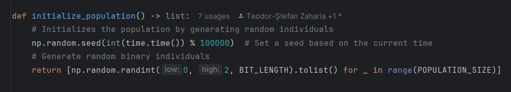
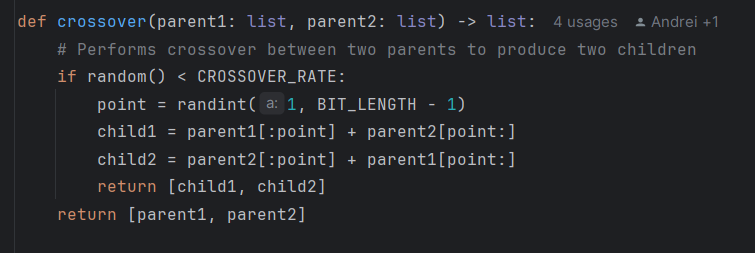
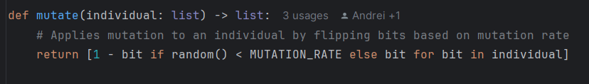
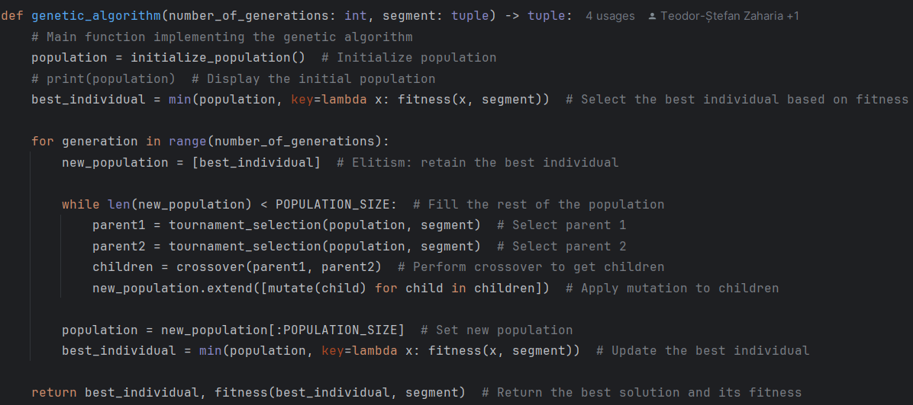
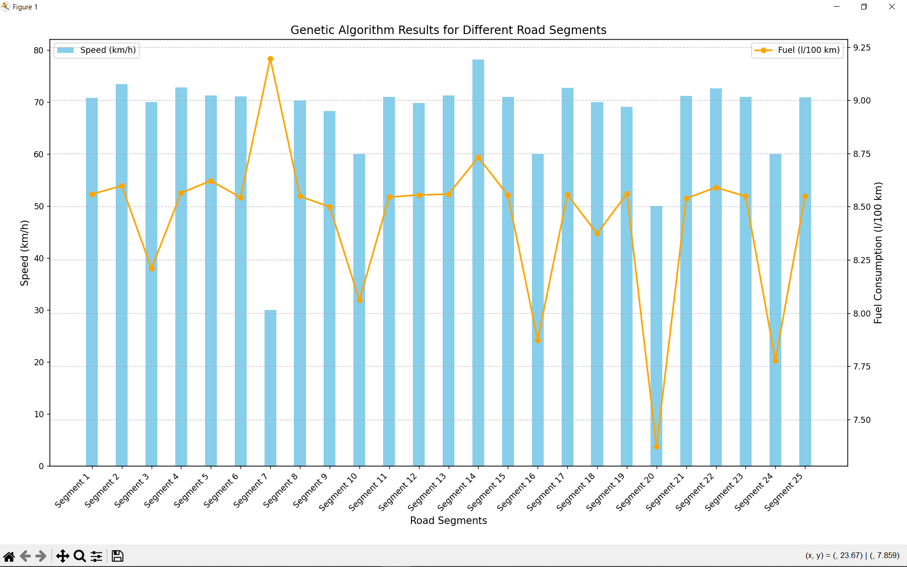

**MinFull Documentation**

**1.Problem description**

In this project, we are tasked with optimizing driving speed and fuel consumption across different road segments. Each road segment has unique characteristics such as:

- Minimum and Maximum Speed: These limits are determined by road signs, regulations, and road conditions (e.g., curves, intersections).
- Slope Angle: The incline or decline of the road influences fuel consumption and speed, as steep roads may require slower speeds to avoid excessive fuel consumption.
- Curve Radius: Sharp curves demand slower speeds to ensure safety, increasing fuel consumption due to the need for frequent speed adjustments.

The objective of the optimization process is to find the optimal driving speed for each segment, which minimizes fuel consumption while respecting the road’s physical constraints. The genetic algorithm is chosen due to its capacity to explore vast solution spaces without requiring an explicit formula for the optimization problem. Additionally, it can effectively balance multiple objectives, such as speed and fuel consumption, which are often conflicting.

**Why Genetic Algorithms?**

Genetic algorithms (GAs) are particularly suited for problems where the solution space is large and complex, and where traditional optimization methods might struggle. In this case, the problem doesn't have a simple closed-form solution or gradient-based methods, making GAs an ideal choice for navigating the complex search space of possible speeds and fuel consumption values.

**2.Theoretical Aspects of the Algorithm**

Genetic algorithms are evolutionary algorithms based on the process of natural selection. They are designed to evolve solutions over successive generations by mimicking the process of natural evolution, including selection, crossover, mutation, and inheritance.

**Key Components of the Genetic Algorithm:**

- Representation of Solutions (Genes): In this project, a solution is encoded as a binary string (bit vector), where each bit represents a potential decision point for the optimization. Specifically, each bit could represent a discrete speed value (or range of values) for a given road segment. The representation is crucial because it allows the genetic algorithm to explore a variety of possible speeds, facilitating better optimization of fuel consumption.

- Selection Process: The process of selecting individuals for reproduction is based on tournament selection. In tournament selection, two individuals from the population are randomly chosen, and the one with the higher fitness (better solution) is selected for the next phase. This mimics natural selection, where the fittest individuals are more likely to reproduce and pass on their genes.

- Crossover Process: Crossover combines two parent solutions to produce offspring. This mimics the genetic recombination process in biology. Crossover enables the algorithm to combine beneficial traits from both parents, creating new solutions that might be better than the original ones.

- Mutation Process: Mutation introduces small random changes in the offspring, adding diversity to the population. This prevents premature convergence to suboptimal solutions and helps explore a broader range of possibilities. In the context of this problem, mutation involves flipping bits in the bit vector representation of the solution.

- Fitness Evaluation: The fitness function is designed to assess how well a solution meets the objectives of the optimization problem. In this case, the fitness function evaluates the balance between speed and fuel consumption. A lower fitness score indicates a better solution, as it reflects a more efficient speed for the road segment with lower fuel consumption.

- Elitism: A form of selection where the best-performing individual is guaranteed to survive to the next generation. This ensures that the best solution found so far is not lost, helping speed up convergence.

**Why Use a Genetic Algorithm for This Problem?**

The problem of optimizing speed and fuel consumption across road segments is inherently nonlinear and complex, with multiple interacting variables. Genetic algorithms are highly effective for these types of problems because they explore the solution space efficiently without requiring explicit gradients or formulas. Additionally, they provide a flexible framework that can be adapted to multiple objectives (e.g., optimizing both speed and fuel consumption simultaneously).

**3.Problem-Solving Approach**

For each road segment, the genetic algorithm follows these steps:

1. **Population Initialization**: An initial population of individuals is created, with each individual representing a possible solution, i.e., a speed that could be used for the road segment.
1. **Selection**: Two individuals are selected from the population using tournament selection to form a pair of parents.
1. **Crossover**: The selected parents are combined to produce two offspring. This process combines the parents' traits to explore new solutions.
1. **Mutation**: After crossover, the offspring undergo mutation, where certain bits are randomly changed to ensure diversity in the population.
1. **Fitness Evaluation**: Each individual in the population is evaluated based on its **fitness**, which is a measure of how well it performs in terms of speed and fuel consumption.
1. **Population Replacement**: After each cycle of selection, crossover, and mutation, the population is updated with the new solutions.

These steps are repeated until a maximum number of iterations is reached or a sufficiently good fitness value is found.

**4.Listing Significant Parts of the Source Code with Explanations and Comments**

Population Initialization (initialize\_population):

This function creates an initial population of individuals. Each individual is a bit vector (0 or 1), representing a possible speed for the road segment.

Tournament Selection (tournament\_selection):

This function creates an initial population of individuals. Each individual is a bit vector (0 or 1), representing a possible speed for the road segment.

Crossover:

The crossover process involves swapping parts of the parents’ code to create new solutions (offspring). This allows for the exploration of combinations of features between the two parent solutions.

Mutation (mutate):

The mutate function introduces randomness into the genetic algorithm by modifying individual solutions (bit strings). Mutation occurs with a probability defined by the MUTATION\_RATE. The mutation process involves flipping each bit of the individual's representation (from 0 to 1 or vice versa), based on the mutation rate.

Genetic Algorithm (genetic\_algorithm):

The genetic\_algorithm function implements the core of the genetic algorithm. It aims to optimize the speed on a road segment by evolving a population of possible solutions over a set number of generations. Below are the key steps of the algorithm:

Population Initialization: The function starts by creating an initial population of individuals using the initialize\_population() function. This represents the starting point of the algorithm.

Best Individual Selection: The initial population is evaluated, and the best individual (with the minimum fitness value) is selected as the starting solution. This individual is guaranteed to remain in the population due to elitism.

Main Loop:

For each generation:

A new population is created, starting with the best individual from the previous generation.

While the new population doesn't reach the required size (POPULATION\_SIZE), two parents are selected from the population using tournament selection.

Crossover is applied to the parents to generate children (new solutions).

Mutation is applied to the children to introduce randomness and maintain diversity in the population.

Population Replacement: The new population (with mutated children and the best individual) replaces the old population. The best individual is then re-evaluated for fitness.

Convergence Check: If the fitness of the best individual in the current generation is lower than a threshold defined by EPSILON (i.e., the solution has reached an acceptable quality), the algorithm stops early.

Return: The function returns the best solution found and its fitness.

**5.Results Obtained by Running the Program in Different Situations, Screenshots, and Comments on the Results**

The results from running the genetic algorithm on 25 road segments demonstrate the algorithm's ability to optimize the driving speed and fuel consumption for each segment. Below is a graph of the outcomes.

**Best Speed and Fuel Consumption**

**Speed (km/h):** The best speed found for each road segment is quite variable, reflecting the different conditions of each segment. For example, segments with more challenging conditions, such as sharp curves or steep inclines, tend to result in lower optimal speeds. Conversely, flatter and more straightforward segments allow for higher optimal speeds. Here are a few notable observations:

Segment 7 (with a speed limit of 30 km/h, tight turns, and steep incline) has the lowest optimal speed of 30.00 km/h, corresponding to a high fuel consumption of 9.20 l/100km.

Segment 24, a similar segment with challenging conditions, results in an optimal speed of 60.00 km/h, but a reduced fuel consumption of 7.78 l/100km.

Segment 14 (flat road with a relatively mild incline) yields a higher speed of 78.20 km/h, though the fuel consumption is also high at 8.73 l/100km.

These results align with the expected behavior: segments that require slower driving to ensure safety (sharp curves, steep inclines) tend to result in lower speeds and, in some cases, higher fuel consumption due to frequent speed adjustments.

**Fuel Consumption (l/100 km):** The fuel consumption shows how well the genetic algorithm optimizes fuel usage based on the selected speed. Fuel consumption varies with the road conditions and speed. Notably:

The algorithm generally targets a balance between speed and fuel efficiency.

The highest fuel consumption occurs on Segment 7 (9.20 l/100km) and Segment 10 (8.06 l/100km), where slower speeds might not fully optimize fuel use in certain road conditions.

The lowest fuel consumption is observed on Segment 20 with a 7.37 l/100km, indicating the genetic algorithm found an optimal speed of 50.00 km/h suitable for the road's conditions.

Overall, fuel consumption seems to be higher when the road requires more frequent speed adjustments (due to sharp curves or steep inclines).

**Fitness Evaluation:** The fitness value is an indicator of how effective the genetic algorithm was in balancing speed and fuel consumption. The fitness function used here aims to minimize fuel consumption while maintaining an appropriate speed for the segment.

Best Fitness Values: The best fitness values occur in segments that allow higher speeds with lower fuel consumption, such as Segment 7, Segment 10, and Segment 24, where the best individuals achieved low fitness values, such as 9.12, 17.77, and 23.72, respectively.

Fitness Analysis: As expected, road segments with a mix of high-speed limits and flatter terrain result in lower fitness values (indicating better solutions). For example:

Segment 14 (with a fitness of 9.12) demonstrates a successful optimization for a segment with moderate inclines.

Segment 7 has the highest fitness value (61.97), which correlates to the challenging conditions of this segment requiring more adjustments in speed, leading to a less optimal solution.

**Key Observations**

Impact of Road Conditions on Speed: The genetic algorithm performs well by adjusting the optimal speed based on the road's characteristics. For segments with sharp turns or inclines (such as Segment 7 or Segment 20), the speeds are lower, and fuel consumption is higher due to safety considerations and slower speeds. For flatter roads or those with less challenging conditions, the speeds are higher, and fuel consumption is optimized accordingly.

Fitness and Fuel Consumption Trade-off: The trade-off between speed and fuel consumption is evident. While the algorithm tries to maximize speed where possible, it must balance it with minimizing fuel consumption. This is clearly reflected in segments like Segment 14 and Segment 24, where moderate speeds yield optimal results.

Evolution of Solutions: Over the generations, the algorithm converges toward an optimal solution. In the case of segments with highly challenging conditions, the genetic algorithm might not converge to a significantly better solution, as seen in Segment 7 where the fitness value remains high. This can be attributed to the inherent difficulty of optimizing fuel consumption in conditions where speed must be drastically reduced for safety.

**6.Conclusions**

The genetic algorithm successfully optimizes both speed and fuel consumption across the road segments, demonstrating its ability to adapt to different road conditions. Some key insights from the results are:

- Optimization Efficiency: The algorithm efficiently finds the balance between speed and fuel consumption, particularly on segments where high speed is feasible without compromising safety. For more challenging segments (e.g., steep inclines, sharp curves), the algorithm correctly adjusts speeds to ensure safe and efficient driving.
- Adaptability to Different Road Conditions: The genetic algorithm adjusts its solutions based on the road's characteristics. On segments with more difficult terrain, it prefers slower speeds to reduce fuel consumption and ensure safety, while on flatter, less challenging segments, the algorithm targets higher speeds to minimize fuel usage without sacrificing safety.
- Convergence and Fitness: The algorithm generally converges quickly to a good solution, although segments with extreme conditions (sharp curves, steep inclines) may present challenges, resulting in a slower convergence to optimal solutions. These road segments require more fine-tuning of the speed, which can make the optimization process less straightforward.
- Trade-Offs: The balance between speed and fuel consumption is crucial. In some segments, the algorithm had to sacrifice speed to minimize fuel consumption, while in others, it optimized for speed with less emphasis on fuel efficiency. This trade-off is essential for real-world applications, where both objectives are often competing.

**Future Directions:**

While the genetic algorithm performed well in optimizing speed and fuel consumption, there are opportunities to improve it further:

- Complex Fuel Consumption Models: The current model could be expanded by incorporating other variables, such as road surface conditions, vehicle specifications (e.g., engine efficiency), and traffic conditions.
- Hybrid Approaches: Combining the genetic algorithm with other optimization techniques, such as simulated annealing or particle swarm optimization, could further improve solution quality and convergence speed.

By adapting and evolving solutions based on real-time feedback from the road's characteristics, the genetic algorithm shows great promise in optimizing driving strategies across various road conditions.

**7.Bibliography**

- <https://www.researchgate.net/publication/303124714_The_Impact_of_Air_Resistance_on_the_Fuel_Consumption_in_Real_Conditions_within_the_Transport_Operation>
- Transport and Main Roads, (February 2011), Cost-Benefit Analysis Manual, First Edition
- <https://matplotlib.org/>
- Goldberg, D. E. (1989). Genetic Algorithms in Search, Optimization, and Machine Learning. Addison-Wesley.
- Mitchell, M. (1996). An Introduction to Genetic Algorithms. MIT Press.

**8.List of What Each Team Member Worked On**

Andrei Zacordonet

- Researching
- Planning
- Implementing the functions of the genetic algorithm
- Transformation of the mathematical model into code
- Refining road segments
- Conducting tests
- Generating the result graph
- Refactoring code
- Documentation

Teodor-Stefan Zaharia

- Researching
- Planning
- Generating road segments
- Refining road segments
- Analyzing the result graph
- Refactoring code
- Refactoring comments
- Documentation
